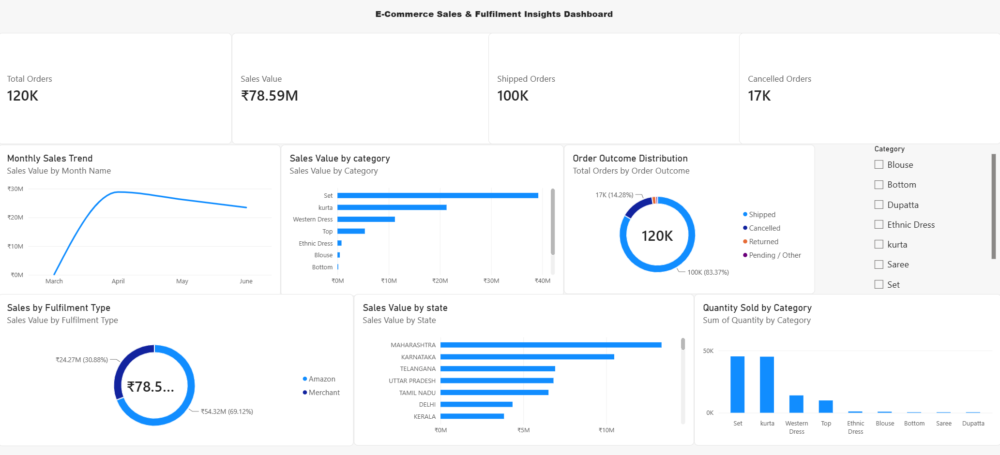

**E-Commerce Sales \& Fulfilment Insights Dashboard**

**Objective:** To analyse e-commerce sales, order outcomes, fulfilment type, product categories, and high-performing states using Power BI.

**Dataset Source:** Amazon Sale Report.csv from the Kaggle E-Commerce Sales Dataset.

**Tools Used:** Power BI Desktop and Power Query.

**Data Preparation:**

• Removed the unnecessary Index column.

• Renamed columns to make them easier to understand.

• Converted Date to the correct date format.

• Created Year, Month Name, Month Number, and Order Outcome fields.

**Key Measures Created:**

• Total Orders

• Sales Value

• Shipped Orders

• Cancelled Orders

• Returned Orders

**Dashboard Features:**

• KPI cards for key performance indicators.

• Monthly sales trend analysis.

• Sales analysis by category and state.

• Order outcome and fulfilment type analysis.

• Interactive Category slicer to filter the dashboard.

**Key Insights**

• The dashboard records about 120K total orders and ₹78.59M in sales value.

• Around 100K orders were shipped, while approximately 17K were cancelled.

• Maharashtra is the highest-sales state in the dashboard.

• Set contributes the highest sales value and quantity sold.

• Sales and fulfilment performance can be explored interactively using the Category filter.

**Dashboard Preview**

